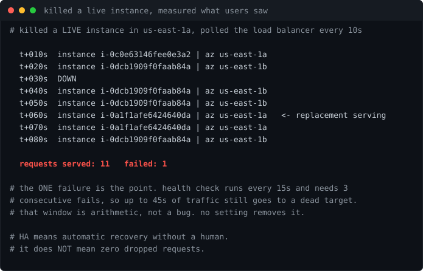

# Lab 13: Highly Available Application Platform

<p align="center"></p>

[](https://github.com/ChromeData/HA-Application-Platform/actions/workflows/tests.yml)

**A load balanced, self healing platform across two availability zones, with Terraform state where a team could actually share it. Then I killed a live instance and measured how many requests users lost.**

| | |
|---|---|
| **Domains** | AWS, Terraform, availability engineering |
| **Built on** | AWS primitives directly, then the network refactored onto a module I extracted from it |
| **Cost** | A few cents. ALB and two t3.micro for under an hour, destroyed after |
| **Status** | Built and broken on real AWS. 11 of 12 requests survived an instance kill (findings/) |

## Situation

Two availability zones on an architecture diagram is a claim, not a property. Plenty of "highly available" designs route everything through one AZ, replace instances that were fine, or leave broken ones serving traffic, and nobody notices until an outage.

## Task

Build the platform properly, put the Terraform state somewhere a second engineer could work from, then break it on purpose and measure what a user would have seen.

## Action

**Remote state first, before any infrastructure.** S3 bucket, versioned and encrypted, TLS only, with a DynamoDB table holding the lock. Local state works right until a second engineer exists, then two applies race and the last write silently wins. I proved the lock by planting a lock item as a fake teammate and watching Terraform refuse to proceed.

**Two AZs, because an AZ is the failure domain.** Availability zones are queried from the API rather than hardcoded, since `us-east-1a` is not the same physical building for two different accounts.

**Health checks that actually evict.** The autoscaling group uses `health_check_type = "ELB"`, not the EC2 default. EC2 only asks whether the instance is running, so a host whose web server has died stays in service indefinitely. Thresholds are asymmetric on purpose: two successes to return, three failures to leave. Slow to trust, quick to evict.

**A chaos script** ([`scripts/chaos.py`](./scripts/chaos.py)) that terminates a live instance and polls the load balancer every ten seconds, so availability is measured rather than assumed.

## Result

**Killed an instance in `us-east-1a`. Traffic shifted to the surviving AZ, a replacement launched, and it was serving about sixty seconds later. 11 requests served, 1 failed.**

**The one failure is the finding.** It would be easy to report "the site stayed up." It did not, entirely. The health check runs every 15 seconds and needs 3 consecutive failures before the load balancer stops routing to a dead target, so there is a window of up to 45 seconds where traffic still goes somewhere that is gone. Tightening the interval shrinks the window and raises the odds a briefly slow instance gets evicted for nothing. No setting removes it. Closing it properly takes client retries, or connection draining with a lifecycle hook so the instance leaves the pool before it dies rather than after.

Highly available means automatic recovery without a human. It does not mean zero dropped requests, and a two AZ diagram does not give you zero downtime.

<sub>Two failures along the way, both mine. Every instance failed its health check forever because `user_data` ran `dnf install nginx` while the private subnets have no route off the network, by design. The fix was to stop needing the internet rather than add a $32/month NAT gateway. And the first chaos run **passed falsely**: it grabbed `Instances[0]`, which was a stale already terminated entry, killed something dead, and produced exactly the output a successful test produces. Target selection is now its own tested function. Both written up in [LAB-NOTES.md](./LAB-NOTES.md).</sub>

## The network became a module

Every resource here was written out by hand first, on purpose. The value is knowing what a target group health threshold actually does, and you do not learn that by wiring up somebody else's abstraction over it.

But once lab 12 and this lab both had the same hand-written VPC, roughly 22 near-identical resources between them, the copies started to drift. Lab 12's verifier found the default security group wide open; this lab only got that fix because I remembered to carry it across. A third lab would not have.

So the network was extracted into a module, [terraform-aws-secure-vpc](https://github.com/ChromeData/terraform-aws-secure-vpc), and this lab is its first consumer. `terraform/network.tf` went from 130 lines to a module call pinned at `v0.1.0`.

**The refactor is where the actual lesson was.** Moving a resource into a module changes its address in state, and Terraform tracks resources by address, so a cosmetic change reads as *destroy the entire network and rebuild it*. On a live environment that means the subnets gone, the instances with them, and a new DNS name on the load balancer.

I measured it offline with the null provider rather than paying to find out:

```
without moved blocks    Plan: 3 to add, 0 to change, 3 to destroy
with moved blocks       Plan: 0 to add, 0 to change, 0 to destroy
```

Nine `moved` blocks now sit in `network.tf`. Two are not clean one-to-one mappings and the comments say so: the old config shared one private route table across both AZs where the module gives each its own, so one table maps to index 0, index 1 is genuinely new, and the association for the second AZ gets replaced. Written up in [`findings/state-move-proof.txt`](./findings/state-move-proof.txt).

## What I did not build

AWS provides the primitives. The architecture, the state backend design, the chaos script, the measurement, and the module the network now sits on are mine. No community Terraform module was used.

## Run it

```bash
terraform -chdir=terraform/bootstrap init && terraform -chdir=terraform/bootstrap apply
terraform -chdir=terraform init && terraform -chdir=terraform apply
python scripts/chaos.py --alb $(terraform -chdir=terraform output -raw alb_dns)
terraform -chdir=terraform destroy
```

Needs Terraform 1.9+, Python 3, boto3.

## Findings

[`findings/`](./findings/) holds the real chaos run. [LAB-NOTES.md](./LAB-NOTES.md) is the session by session log.

## License

MIT. See [LICENSE](./LICENSE).
